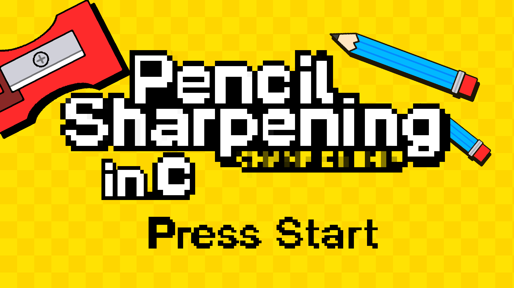
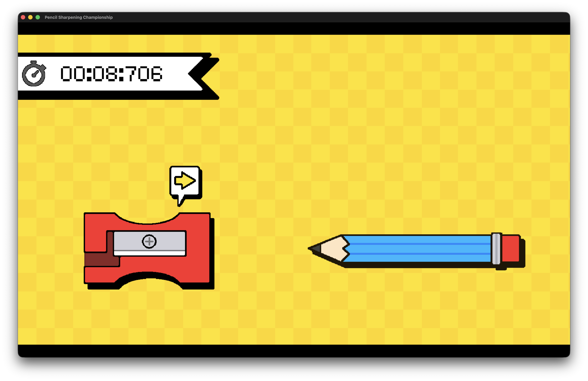

# Pencil Sharpening Championship 📝✏️




**Description**  
Fast-paced pencil sharpening game made in C with SDL2. Hit the arrows at the right time to sharpen your pencil and score points!

---

## Controls
- Arrow Keys → sharpen pencil
- Enter / Return → start game
- R → replay (at the end)
- ESC → quit (at the end)

## Requirements

- SDL2
- SDL2_ttf
- SDL2_image
- macOS, Linux, or Windows with a C compiler

---

## Build & Run


### macOS App Bundle

```bash
make mac
open build/Pencil.app
```

### Windows (MinGW)
```bash
x86_64-w64-mingw32-gcc src/main.c -o pencil.exe -IC:/SDL2/include -LC:/SDL2/lib -lmingw32 -lSDL2main -lSDL2 -lSDL2_image -lSDL2_ttf
```
### dev
```bash
make
./pencil -dev   # use development assets
```

Credits: 

- Font : [C&C Red Alert](https://www.dafont.com/c-c-red-alert-inet.font)
- Game : [Goodgis](https://www.youtube.com/@Goodgis)
- SDL2 Libraries

squach90 - 2025
